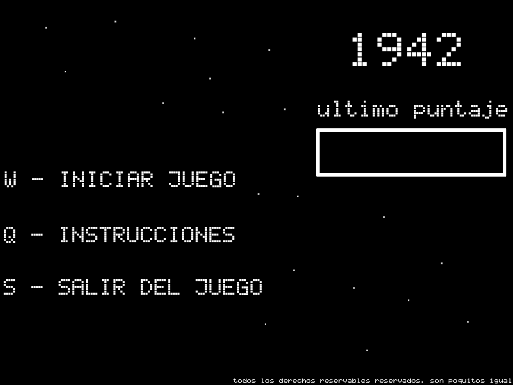
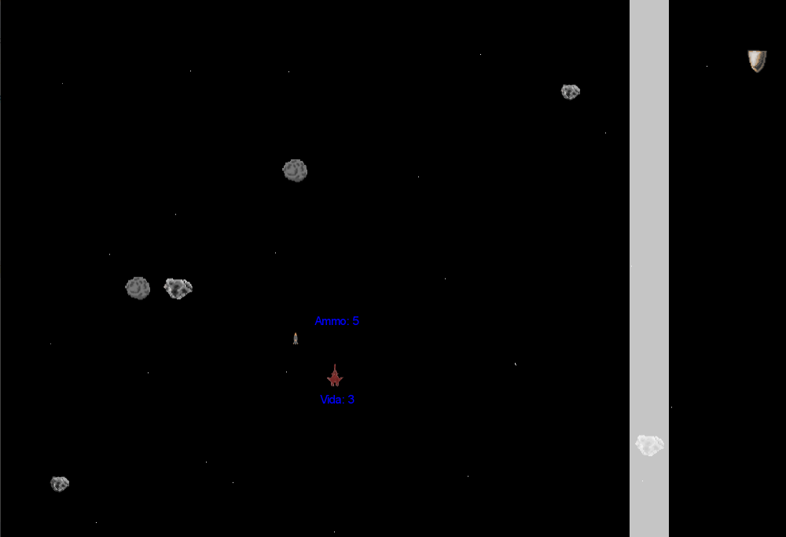

# 1942

## Equipo de desarrollo

BERONNE LUCAS,
CAJAL, FACUNDO ,
KANESHIRO DAIANA ,
LIFRIERI GONZALO ,
MOYANO LAUTARO,
SANCHEZ ROCIO

## Capturas

## Reglas de Juego / Instrucciones

*Inicialmente el avion comienza en el centro inferior

*Presionando las flechas del teclado puede moverse en las 4 direcciones

*Presionando la barra espaciadora puede disparar

*Presionando la letra "q" puede modificar las balas

*El objetivo del juego es juntar el mayor puntaje posible sin ser destruido por un asteroide

*El jugador que pilota el avion debe disparar a los asteorides para poder sumar puntos

*A su vez debe recoger las municiones que caen para poder continuar disparando

**Pepita te esta buscando...**

## Respuestas teóricas

Polimorfismo =>
	
 ¿Cuál es el mensaje polimórfico? ¿Qué objetos lo implementan? ¿Qué objeto se aprovecha de ello?
 
 Hay dos casos importantes de uso de polimorfismo:
 
 - Uno es en el movimiento de todos los objetos: Primero les consulta a cada uno si seMueve (mensaje al que todos los objetos deben responder) y despues a aquellos que si los mueve acorde a su velocidad.
 
 - Los templates responden polimorficamente a los lanzadores para crear el objeto en base a los valores que guardan.

Colecciones =>

¿Qué operaciones de colecciones se utilizan? ¿Usaron mensajes con y sin efecto? ¿Para qué?

Tenemos unos lanzadores de objetos que eligen de una tabla de templates para crear las instancias de los asteroides y provisiones aleatoramiente. Es sin efecto, en este caso, ya que es solo consulta.

El avion agrega municion en base a una posicion del rifle, este si tiene efecto ya que el cartucho agarrado se le aumenta la municion que guarda.

Para ver si dos objetos pueden colisionar cada uno puede consultar si el objeto en si con el que va a chocar es del tipo compatible. Aca nuevamente es simplemente una consulta.

Las animaciones utilizan una lista de imagenes que se muestran de manera rapida.

Finalmente, para mantener la performance del juego tenemos almacenamientos de posiciones que van siendo guardadas a medida que los objetos salen del juego. Al momento de agregar una nueva entidad, se verifica si hay alguna posicion que se pueda reutilizar. Una vez verificada, tambien se chequea que no haya accidentalmente sido tomada por otra entidad justo en ese mismo instante (pasaba muy seguido...) revisando otra lista de posiciones activas.

Clases =>

¿Usan clases? ¿Por qué?

Usamos varias clases para evitar la repeticion de codigo ya que muchas de nuestras clases/objetos compartian atributos y metodos. Por ejemplo, muchos objetos hacian una misma accion (moverse, chocar entre si, morir) y usar clases nos permitio encapsular todos esos comportamientos para que despues podamos reutilizarlos en donde sea necesario y enfocarnos en hacer el comportamiento especifico. Ademas, era necesario para instanciar en el juego un mismo tipo de objeto (por ejemplo, las balas, los asteroides, animaciones y sonidos)

 ¿Dónde o cuándo se instancian los objetos?
 
 En el menu y controles hay algunos objetos de texto que se van instanciando para mostrar cosas en pantalla.
 
 Los lanzadores de objetos van instanciando los asteroides y las provisiones que caen de arriba.
 
 El avion al disparar instancia un tipo de bala.
 
 El propio avion es un objeto con un tipo de arma y armadura.
 
 Hay tres tipos de armaduras, que estan instanciadas pero solo se comunican cuando el propio avion tiene como armadura.
 

 ¿Entre quiénes y por qué? ¿Qué comportamiento es común y cuál distinto?
 
 "GenericObject" es la clase super que comparten la clase "MovingObject" y el objeto "avion". 
 Tanto MovingObject como avion comparten los atributos [tipo-tiposQueChocaContra-image-position] y los metodos [seMueve()-impactarContra()-aplicarEfectoSobre()-morir()-puedeChocarContra()]
 La clase MovingObject contiene ademas el atributo "velocidad" 
 El objeto avion contiene los atributos arma y armadura
 "GenericObject" es la clase super que comparten la clase "MovingObject" y el objeto "avion". Generic oiene metodos para impactar contra otros objetos, obtener la posicion, la imagen, su propio tipo y los tipos con los que puede chocar contra (cada clase u objeto que hereda de este tiene su propio listado de tipos con los que puede chocar). 
 Tanto MovingObject como avion comparten los atributos [tipo-tiposQueChocaContra-image-position] y los metodos [seMueve()-impactarContra()-aplicarEfectoSobre()-morir()-puedeChocarContra()] que vienen de GenericObject. 
 La clase MovingObject contiene ademas el atributo "velocidad" y el metodo desplazar. Tanto las balas, asteroides y las provisiones heredan de esta clase y utilizan este metodo para moverse automaticamente.
 Los asteroides tienen un efecto especial al morir - ademas de salir del tablero agregan puntos al avion.
 El objeto avion contiene los atributos arma y armadura, que son objetos con sus propios metodos.
 
 La herencia ocurre principalmente para evitar la repeticion de logica y ademas estructurar el codigo de manera jerarquica (queda claro quien se tiene que encargarse de que y permite generalizar algo rapido si nos damos cuenta que estamos repitiendo codigo en algun lugar)

Composición =>

¿Qué objetos interactúan? ¿Dónde se delega? ¿Por qué no herencia?

El avion se compone de una armadura y de un arma. Resultaba mas natural que ambos sean una propiedad y que no haya multiples subclases de aviones, aunque en la version actual del juego si seria posible usar herencia en el tipo de armadura de avion (apenas intentemos agregar tipos de arma ya no podriamos, ya que habira una masiva repeticion de codigo por que la herencia ya estaria quemada). 

El avion se comunica con el arma para disparar y cargar la municion (la interaccion con la caja de municion al chocar la hace el avion). En cuanto a la armadura, el comando de usar la habilidad especial envia primero un mensaje al avion ya que solo el avion sabe la armadura que tiene. Ademas, la propia imagen del avion la saca de la armadura que tiene puesta, como tambien la vida actual.

